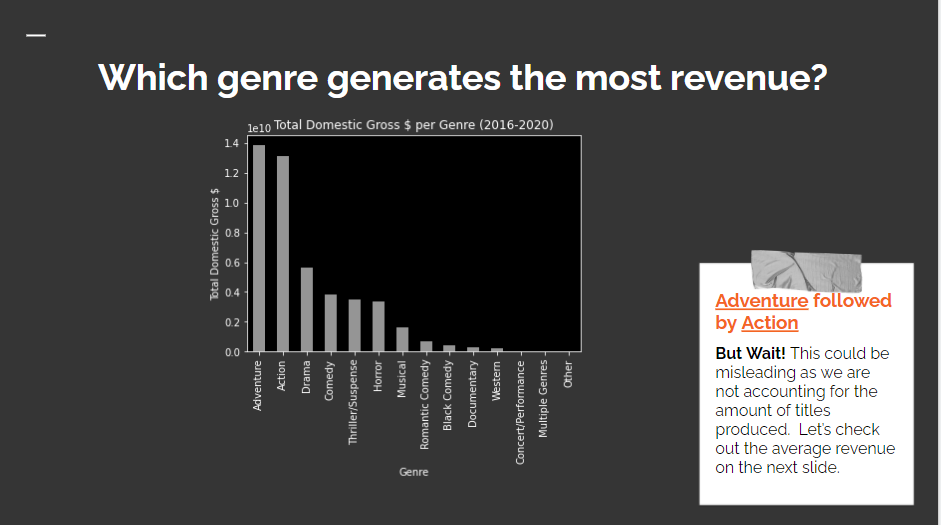
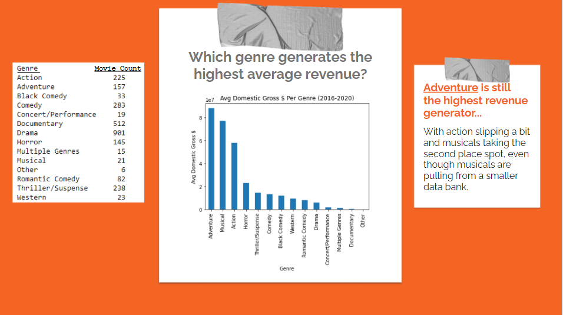
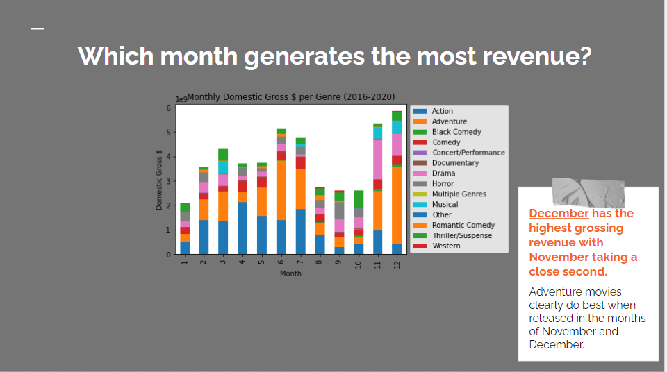

# Movie-Analysis_Microsoft

## Summary
Microsoft sees all the big companies creating original video content, and they want to get in on the fun. They have decided to create a new movie studio, but the problem is they don’t know anything about creating movies. They have hired you to help them better understand the movie industry.

When venturing into new business territory, it is important to understand what options are most viable in order to make smart and efficient business decisions.   Reviewing the industry history can help lead us in the right direction.

With the help of data science, we can create analysis to help understand what types of films do best at the box office.
With the analysis we should be able to give solid answers to questions such as:
* Which genres gross the highest revenue amount?
* Which month is best for releasing movies?
  * Which genres bring in the most revenue during which time of year?
* Which genres are not widely produced but make a lot of revenue?
* Which genres release more titles into the box offices?

### Contributors
* Crissy Bruce
* Deric Williamson

## Approach
* Web Scraping
  * gathered the raw data from The Numbers.com
  * collected data by top one-hundred per month for the last five years
* Data-Cleaning
  * prepared the data for utilazation
  * expoted clean data in a .csv file
* Querying
  * presenting the data in a fashion that is easy to back up recommendations
  
### Applications Utilized
Data Science Tools used:
  * Jupyter Notebook (Python)
    * Requests
    * pandas
    * matplotlib
Websites used:
  * The numbers.com
  
  ## Insights

  
  
  ## Recommendations
  
*  After data analysis, we would recommend our company to produce an adventure movie.

*  The best performing genre in terms of gross revenue and average gross revenue per title is Adventure.

*  If you decide to release an adventure movie, our data shows that December is the highest gross revenue generating month.

*  Lastly, adventure has one of the highest title counts produced in the industry.

